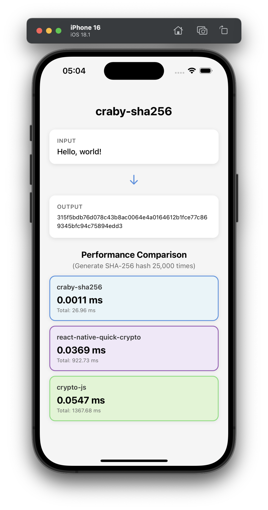

# craby-sha256

Demo library for [Craby](https://github.com/leegeunhyeok/craby)

## Overview

```rust
// Rust implementation
use sha2::{Digest, Sha256};

impl CrabySha256Spec for CrabySha256 {
    fn digest(&mut self, data: &str) -> String {
        format!("{:x}", Sha256::digest(data.as_bytes()))
    }
}
```

```ts
// Usage
import { Sha256 } from 'craby-sha256';

// Result: 315f5bdb76d078c43b8ac0064e4a0164612b1fce77c869345bfc94c75894edd3
Sha256.digest('Hello, world!');
```



## Installation

```bash
npm install craby-sha256
```

## License

[MIT](LICENSE)
